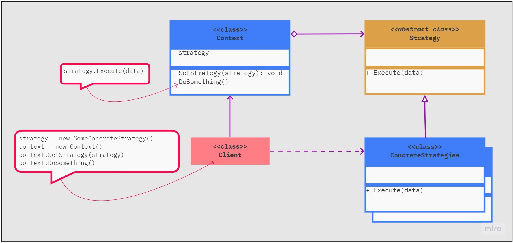

# Patrones de comportamiento

Los patrones de comportamiento están específicamente relacionados con la comunicación entre objetos, por lo tanto gestionan algoritmos, relaciones y responsabilidades entre objetos.

Se encargan de una comunicación efectiva y la asignación de responsabilidades entre objetos.

* **Strategy:** Define familias de algoritmos, los encapsula y manejar su selección

| Diagrama UML del patrón       | Diagrama UML del ejemplo       |
| ----------------------------- | ------------------------------ |
|  |  |
|  |  |
