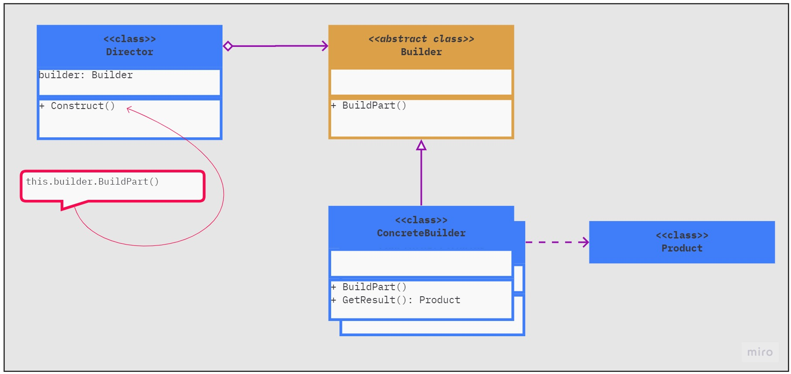
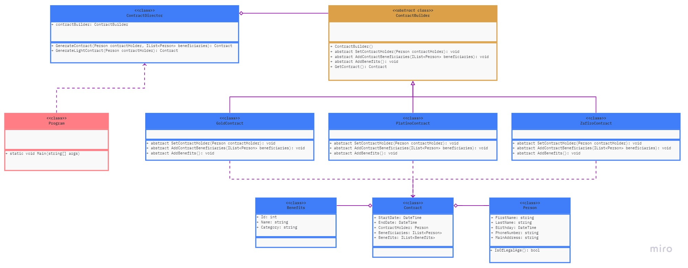

# Patrones creacionales

Los patrones creacionales  facilitan la tarea de creación de nuevos objetos, de tal forma que el proceso de creación pueda ser desacoplado de la implementación del resto del sistema.

Proporcionan mecanismos de creación de objetos que incrementa la flexibilidad y la reutilización de código existente.

* **Builder:** Permite construir objetos complejos paso a paso. Este patrón nos permite producir distintos tipos y representaciones de un objeto empleando el mismo código de construcción.

| Diagrama UML del patrón       | Diagrama UML del ejemplo       |
| ----------------------------- | ------------------------------ |
|  |  |