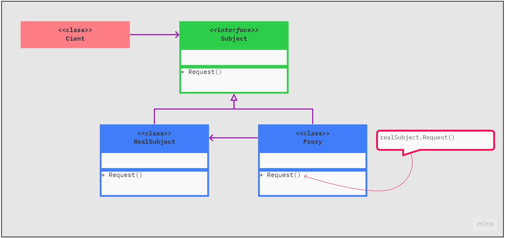
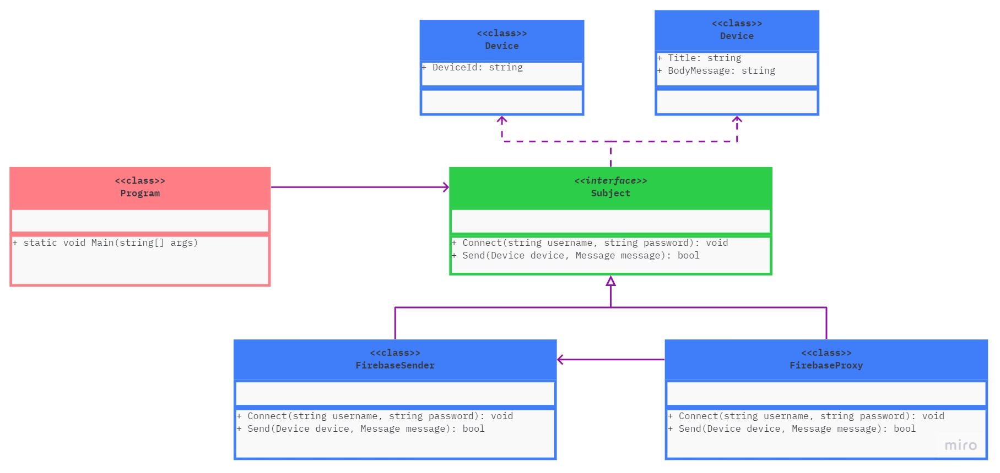

# Patrones estructurales

Los patrones estructurales nos ayudan a definir la forma en la que los objetos se componen

Explican cómo ensamblar objetos y clases en estructuras más grandes a la vez que se mantiene la flexibilidad y eficiencia de la estructura.

* **Proxy:** Permite proporcionar un sustituto o marcador de posición para otro objeto. Un proxy controla el acceso al objeto original, permitiéndote hacer algo antes o después de que la solicitud llegue al objeto original.

| Diagrama UML del patrón       | Diagrama UML del ejemplo       |
| ----------------------------- | ------------------------------ |
|  |  |
