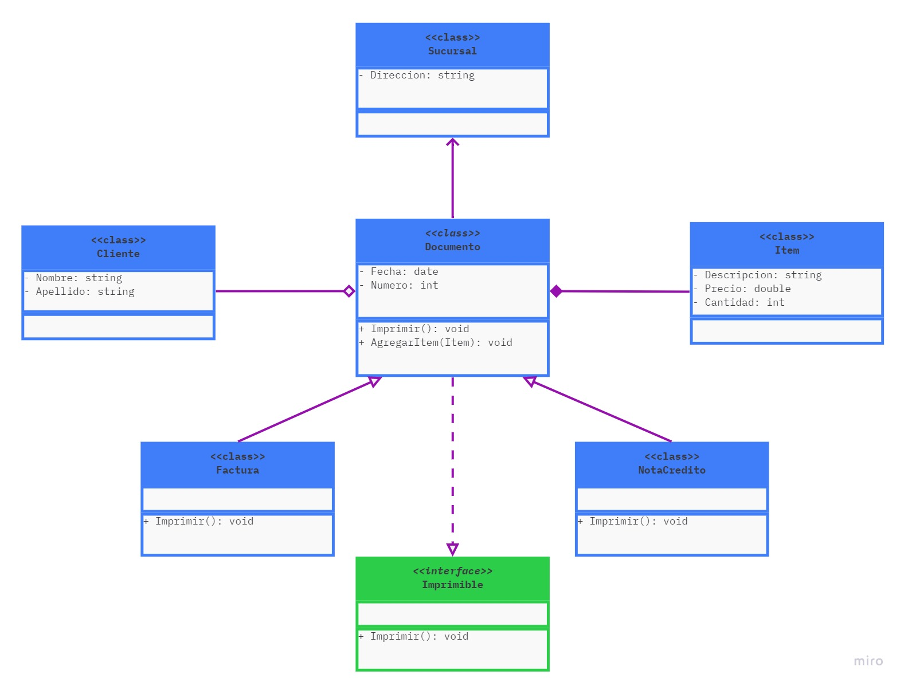

# EJERCICIO DE POO Y RELACIONES ENTRE CLASES

En el siguiente ejercicio podremos poner en práctica las relaciones anteriormente vistas y cómo convertir un diagrama UML a código utilizando el lenguaje de programación c#

Este ejercicio se puede seguir pasa a paso viajando a través de las siguientes etapas descritas en el control de cambios y realizando la verificación de cada uno de los commits generados.

## Etapas del ejercicio

1. Generación del proyecto - ()
2. Generación de todas las clases e interfaces - ()
3. Relación de realización - ()