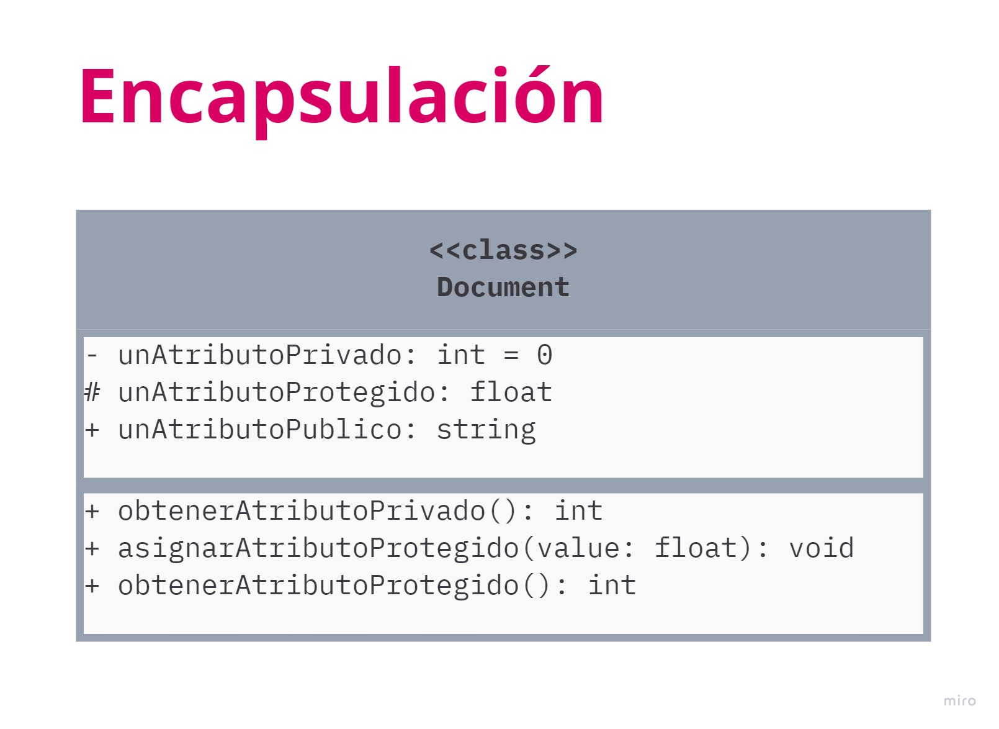
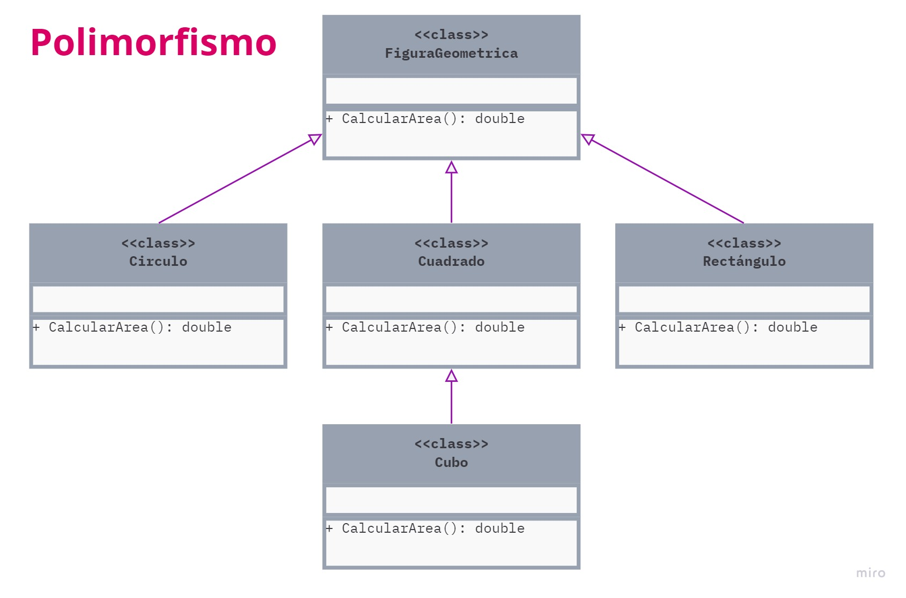

# PROGRAMACIÓN ORIENTADA A OBJETOS

Es un paradigma de programación basado en el concepto  de crear bloques con información y comportamientos, en lotes especiales llamados *objetos* que se construyen a partir de un grupo de *planos* definidos por un programador, estos planos se llaman *clases*

## Clase
Una *clase* es una plantilla, define de manera genérica cómo van a ser los objetos de un determinado tipo. Existe una notación o simbolo que representa a una clase la cual se puede ver en la siguiente imagen, así como se detallan las partes que conforman una clase.  Las clases no deben tener todas estas partes, pero mientras más tengan, más se entenderán los objetos que se creen a partir de esta plantilla.

### Pilares de la programación orientada a objetos

* **Encapsulación:** La encapsulación es la capacidad que tiene un objeto de esconder partes de su estado y comportamiento de otros objetos, exponiendo únicamente una interfaz limitada al resto del programa. Esta propiedad permite asegurar que la información de un objeto esté oculto para el mundo exterior, agrupando las caracteristicas o atributos que cuentan con acceso privado y los momportamientos o métodos que presentan un acceso público.

* **Abstracción:** La abstracción es el modelo de un objeto o fenómeno del mundo real, limitado a un contexto específico, que representa todos los datos relevantes a este contexto con gran precisión, omitiendo el resto.

* **Herencia:** Capacidad de crear nuevas clases sobre otras existentes, para facilitar la reutilización de código. Las subclases tienen la misma interfaz que su clase padre. Puedes extender la funcionalidad de una clase implementando otras interfaces. Define relaciones jerárquicas entre clases de forma que atributos y métodos comunes pueden ser reutilizados

* **Polimorfismo:** El polimorfismo es la capacidad que tiene un programa de detectar la verdadera clase de un objeto e invocar su implementación, incluso aunque su tipo real sea desconocido en el contexto actual. El polimorfismo consiste en diseñar objetos para compartir comportamientos, presentando la misma interfaz y dando la posibilidad de modificar el comportamiento que las clases derivadas realizan.

## RELACIONES ENTRE OBJETOS

**Dependencia:** Es el tipo de relación más básica y débil entre clases y muestra la relación entre un cliente y el proveedor de un servicio.  Un ejemplo puede ser cuando creas una clase Ecuación e implementas un método específico que hace uso de otra clase que brinda un servicio como la clase Math que ya tiene funciones para diferentes operaciones.

**Asociación:** Es una relación en la que un objeto utiliza o interactúa con otro. La relación se diagrama con una flecha simple desde el objeto inicial y apuntando al objeto que utiliza. Generalmente se puede ver una asociación como un campo de un tipo dentro de una clase. Un ejemplo puede ser una clase persona que es propietario de uno o varios perros, pero estos perros son solo de esta persona.

**Agregación:** Tipo especializado de asociación que representa relación de “uno a muchos”, “muchos a muchos” o “todo a partes”. Con agregación, un objeto “tiene” un grupo de otros objetos y sirve como contenedor. El componente puede existir sin el contenedor y también puede vincularse a varios contenedores al mismo tiempo. La relación se muestra por una línea con un diamante vacío en el lado del contenedor y una flecha en el lado del componente.

**Composición:** Tipo específico de agregación en el que un objeto se compone de una o más instancias de otros. La relación se muestra por una línea con un diamante relleno en el lado del contenedor y una flecha en el lado de la instancia.

**Generalización** Indica que una clase (clase derivada) hereda los métodos y atributos especificados por una clase (clase base), por lo cual una clase derivada además de tener sus propios métodos y atributos, podrá acceder a las características y atributos visibles de su clase base (public y protected)

**Realización** El concepto de realización refiere la implementación de un interfaz por parte de una clase. Este proceso tiene dos partes, en primer lugar la clase debe declarar la implementación del interfaz. En segundo lugar la clase debe de definir el cuerpo de los métodos impuestos por el interfaz.

