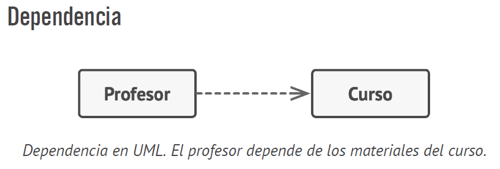
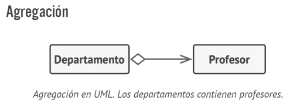
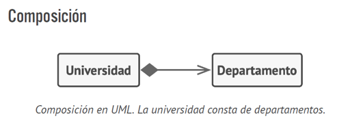

# RELACIONES ENTRE OBJETOS

**Dependencia:** Es el tipo de relación más básica y débil entre clases y muestra la relación entre un cliente y el proveedor de un servicio.  Un ejemplo puede ser cuando creas una clase Ecuación e implementas un método específico que hace uso de otra clase que brinda un servicio como la clase Math que ya tiene funciones para diferentes operaciones.

**Asociación:** Es una relación en la que un objeto utiliza o interactúa con otro. La relación se diagrama con una flecha simple desde el objeto inicial y apuntando al objeto que utiliza. Generalmente se puede ver una asociación como un campo de un tipo dentro de una clase. Un ejemplo puede ser una clase persona que es propietario de uno o varios perros, pero estos perros son solo de esta persona.

**Agregación:** Tipo especializado de asociación que representa relación de “uno a muchos”, “muchos a muchos” o “todo a partes”. Con agregación, un objeto “tiene” un grupo de otros objetos y sirve como contenedor. El componente puede existir sin el contenedor y también puede vincularse a varios contenedores al mismo tiempo. La relación se muestra por una línea con un diamante vacío en el lado del contenedor y una flecha en el lado del componente.

**Composición:** Tipo específico de agregación en el que un objeto se compone de una o más instancias de otros. La relación se muestra por una línea con un diamante relleno en el lado del contenedor y una flecha en el lado de la instancia.

